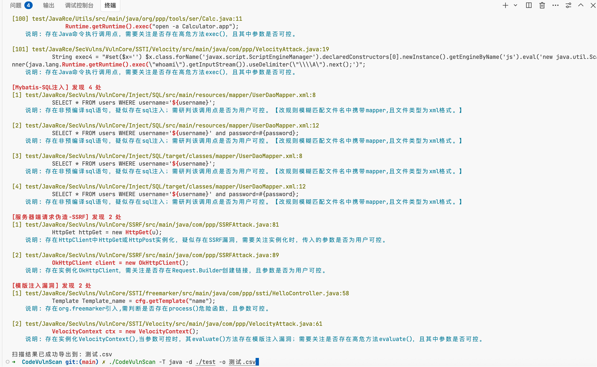
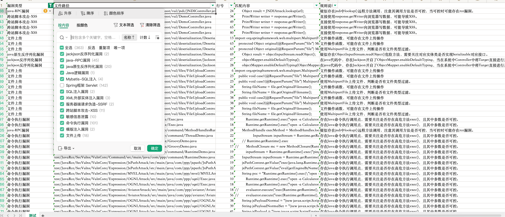

# CodeVulnScan

[](LICENSE)
[](https://golang.org/)
[]()

## 🔍 工具介绍

CodeVulnScan 是一款基于正则表达式的代码安全审计工具，专为红队成员快速定位sink设计。它能够快速扫描目标代码库，定位潜在的漏洞 Sink 点，提升代码审计效率。

> **注意**：工具发现的 Sink 点仅表示存在潜在风险，红队师傅们需要进一步分析 Source 点并验证漏洞是否可被利用。
>
> 开发于 2023.2，虽然技术实现上可能过时，但工具本身仍具有实用价值，开源出来给大家参考使用。


## ✨ 核心特性

### 🛡️ 多语言支持
- **全面覆盖** - 支持 DotNet、Java、PHP、Python 等主流开发语言
- **敏感信息检测** - 自动扫描配置文件中的密码、密钥、令牌等敏感信息

### ⚙️ 高度可定制
- **自定义规则** - 轻松修改各语言的 rule.json 文件，定制专属规则库
- **灵活配置** - 支持指定文件后缀、排除目录、设置最大扫描深度

### 🚀 高效性能
- **并行扫描** - 可配置工作协程数量，充分利用多核性能
- **精准定位** - 扫描结果包含文件路径、行号、匹配内容、规则名称及描述
- **高亮显示** - 结果高亮展示，便于快速定位问题

### 📊 结果处理
- **详细模式** - 可选输出更多扫描信息，便于深入分析
- **CSV导出** - 支持将扫描结果导出为CSV文件，便于后续处理和团队协作


## 🚀 快速开始

### 安装

```bash
# 下载最新版本
git clone https://github.com/guchangan1/CodeVulnScan.git

# 进入项目目录
cd CodeVulnScan

# 编译项目
go build -o codevulnscan
```

### 命令参数

```bash
Usage: ./codevulnscan [options]
```

| 参数 | 说明 |
|------|------|
| `-T <string>` | **审计模式**：选择规则库类型 <br>- 可选值：`java`、`net`、`php`、`python`、`leak` <br>- 默认文件类型：java→.java, net→.cs, php→.php <br>- 所有模式均自动包含敏感信息扫描 |
| `-d <string>` | **扫描目录**：指定要扫描的目标目录 |
| `-nd <string>` | **排除目录**：指定要排除的目录 |
| `-e <string>` | **文件类型**：手动指定要扫描的文件后缀，如 `yml,json,xml` |
| `-v` | **详细模式**：输出更多扫描信息 |
| `-w <int>` | **并行数量**：工作协程数量，默认为0表示使用CPU核心数 |
| `-m <int>` | **扫描深度**：最大扫描深度，默认为100 |
| `-o <string>` | **结果导出**：将扫描结果导出到CSV文件 |

### 使用示例

```bash
# .NET代码审计
./codevulnscan -T net -d /path/to/project

# Java代码审计（排除特定目录）
./codevulnscan -T java -d /path/to/project -nd /path/to/project/vendor

# PHP代码审计（详细模式）
./codevulnscan -T php -d /path/to/project -v

# Python代码审计（自定义并行数）
./codevulnscan -T python -d /path/to/project -w 8

# 专门扫描配置文件中的敏感信息
./codevulnscan -T leak -d /path/to/configs -e yml,json,xml,properties

# 导出扫描结果到CSV
./codevulnscan -T java -d /path/to/project -o results.csv
```

> **提示**：所有扫描模式都会自动包含敏感信息扫描，无需额外指定。


## 📚 使用示例

### 🔧 自定义规则

CodeVulnScan 支持自定义规则，只需创建或修改对应语言的规则文件即可。规则文件使用 JSON 格式，位于 `rules` 目录下。

**规则文件结构：**

```json
[
  {
    "FileType": "java",
    "RegexRule": "Runtime\.getRuntime\(\)\.exec\(",
    "Readme": "Java命令执行函数，可能存在命令注入漏洞",
    "VulName": "命令注入"
  },
  {
    "FileType": "php",
    "RegexRule": "eval\(\$_(?:GET|POST|REQUEST|COOKIE)",
    "Readme": "PHP eval函数直接执行用户输入，存在代码执行漏洞",
    "VulName": "代码执行"
  }
]
```

**规则字段说明：**

| 字段 | 说明 |
|------|------|
| `FileType` | 文件类型，如 java、php、cs 等 |
| `RegexRule` | 正则表达式规则，用于匹配代码中的漏洞点 |
| `Readme` | 规则说明，描述潜在风险 |
| `VulName` | 漏洞名称，用于分类和标识 |

### 📊 扫描结果示例

执行扫描后，CodeVulnScan 会以高亮方式显示扫描结果，包括文件路径、行号、匹配内容、规则名称和描述：

<div align="center">

<br><br>

</div>

### 📁 项目示例

在 `examples` 目录下提供了完整示例：

- `custom_rule_example.json` - 自定义规则示例文件
- `scan_example.sh` - 常用扫描场景的脚本示例

---


